# GreenStore 🌿

GreenStore is a full-stack **ASP.NET Core MVC e-commerce platform** focused on plant sales. It provides a clean interface for users to browse and view products, while admins can manage categories and products efficiently.

---
## 🚀 Live Demo
Check out the live version here:  
👉 [Live Demo on Monster](http://raghadmoqady.runasp.net/)

## 💻 Repository
View the source code on GitHub:  
📂 [GitHub Repository](https://github.com/Raghad-Moqady/Greenstore.git)

---

## Table of Contents
- [Project Overview](#project-overview)
- [Features](#features)
- [Technologies Used](#technologies-used)
- [Screenshots](#screenshots)
- [Future Improvements](#future-improvements)
- [Author](#author)

---

## Project Overview
GreenStore is designed for plant enthusiasts to explore and purchase a variety of plants. The project emphasizes:

- CRUD operations for products and categories.
- Image handling and previews.
- Server-side and client-side validations.
- Structured admin and user areas.

---

## Features

### Admin Area
Manage products and categories with a dashboard powered by AdminLTE 4.
- **Dashboard:** Shows number of products and categories.
- **Category Management:** Create, read, update, delete (CRUD) with image upload, preview before submitting, and validation.
- **Product Management:** CRUD with images, category association, and validation.
- **Validation:** Server-side for all fields and images; client-side for text inputs.
- **Tables & Modals:** View products and categories in table format; modal popup for detailed info.
- **Notifications:** SweetAlert for success messages.

### User Area
 Browse products and categories through a custom-designed layout, with some inspiration drawn from Start Bootstrap templates.
- **Home Page:** Displays the first 4 products with images and categories, using a custom layout with Swiper sliders for headers and categories.
- **All Products Page:** showing all products with cards including image, name, category, price, and a "More Details" button.
- **Product Details Page:** Dedicated page showing full product information including name, image, description, price, quantity, rate, and category name.
- **Navigation:** Navbar linking Home, All Products, and Admin area.
 
### Additional Features
- Swiper sliders for featured headers and category carousel.  
- Conditional display when no products or categories exist.  
- Flash Sale section as a custom promotional banner.  
- Responsive-ish product cards (note: layout is partially custom and not fully responsive across all devices).  

---

## Technologies Used
- **Backend:** ASP.NET Core MVC (.NET 9), C#, Entity Framework Core
- **Frontend:** Razor Views, HTML, CSS, Bootstrap 5, AdminLTE 4
- **Libraries & Plugins:** jQuery, SweetAlert2, OverlayScrollbars, FontAwesome, **Swiper.js** (for sliders/carousels)
- **Database:** SQL Server
- **Deployment:** MonsterASP.net

---

## Screenshots

### Admin Area
- **Dashboard**
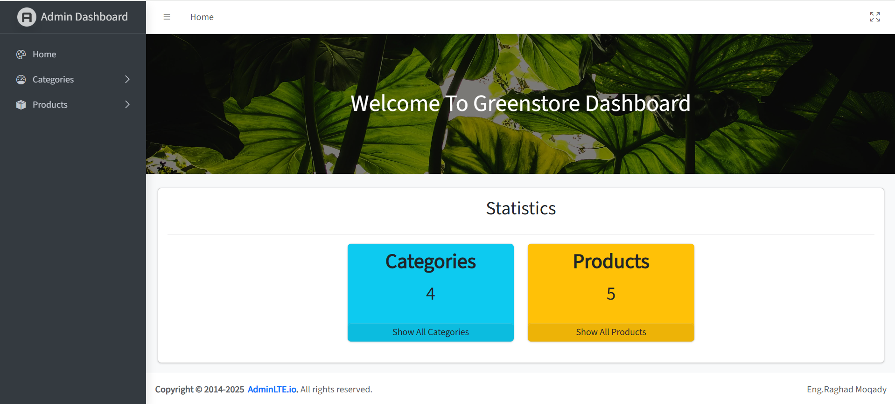

- **Category Management**

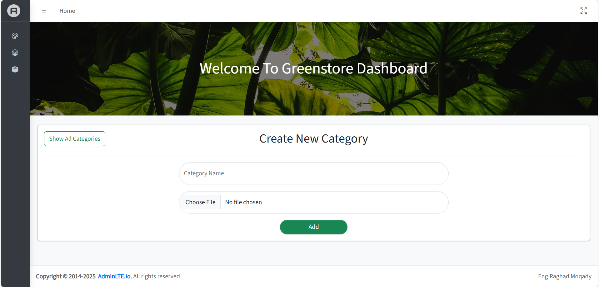
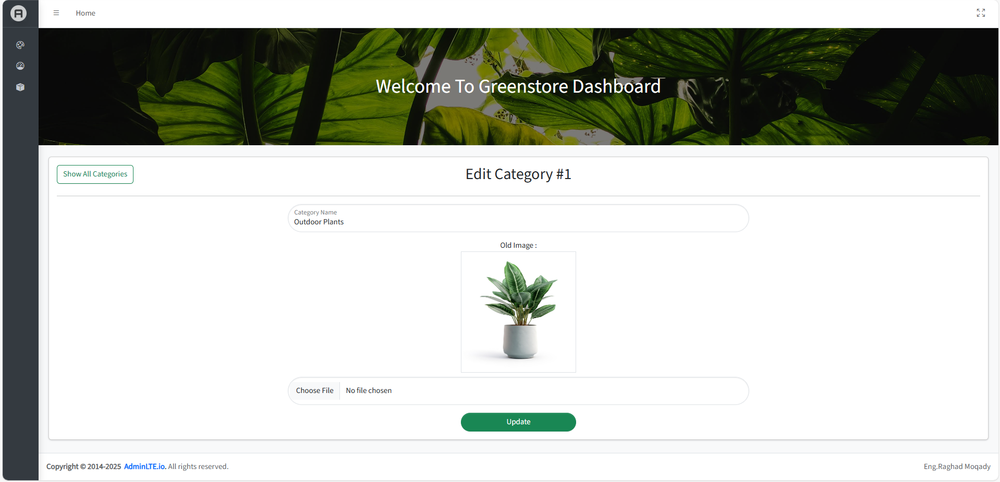

- **Product Management**
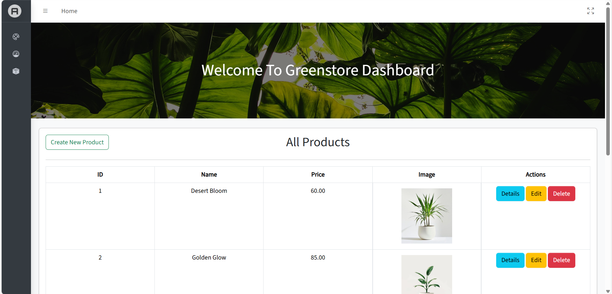
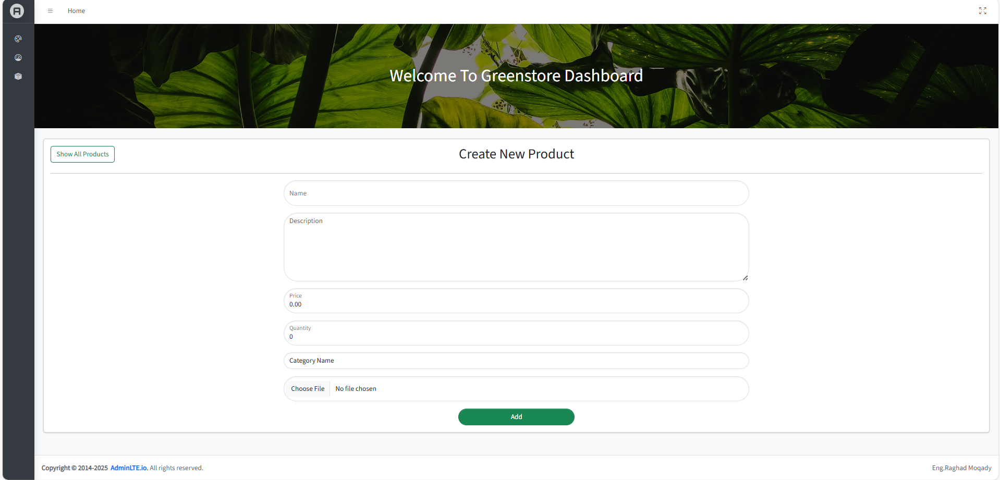
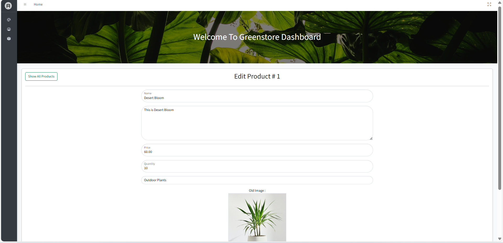

- **Product Details Modal**

---

### User Area
- **Home Page**
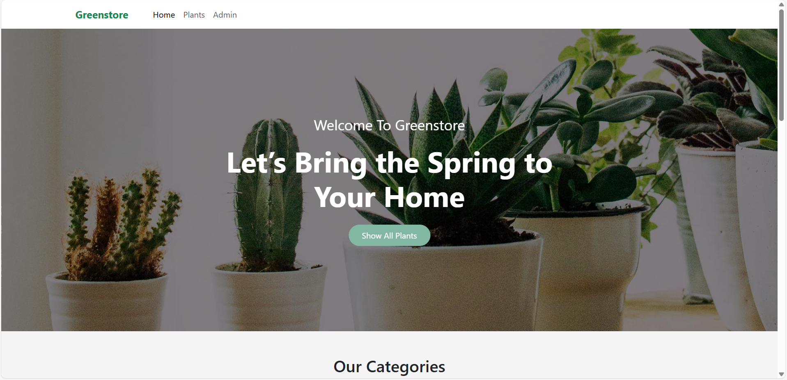
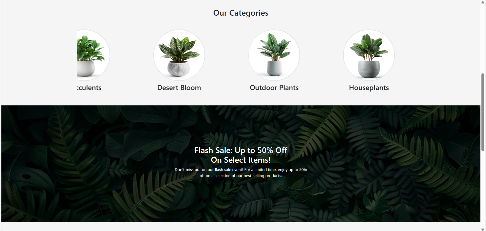
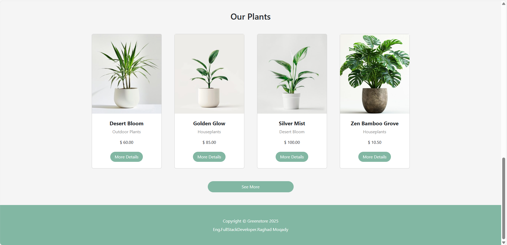
 
- **All Products Page**
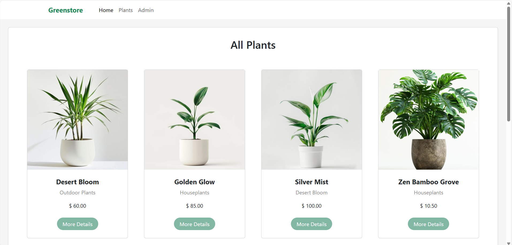

- **Product Details Page**
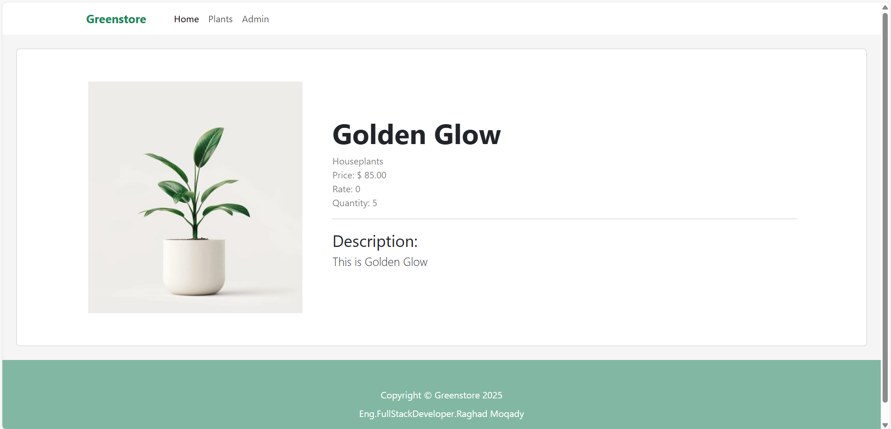

## Future Improvements
- **Client-side Validation:** Enhance forms with client-side validation for inputs and file uploads.
- **Image Preview:** Allow admins to preview images before uploading a product.
- **Lazy Loading Images:** Improve page load performance by loading images on demand.
- **Ajax-based Modal:** Display product details in a modal without full page reloads.
- **Search & Filter:** Add search and filtering functionality for products.
- **Authentication & Roles:** Implement authentication and role-based access for admins and users.
- **Dependency Injection:** Use dependency injection for ApplicationDbContext instead of creating instances in controllers.

---

## Author
**Eng. Raghad Moqady**  
Full Stack Developer

